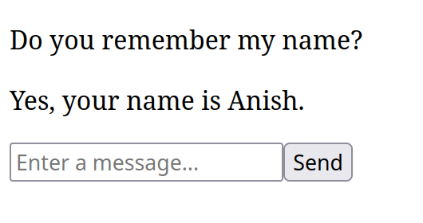
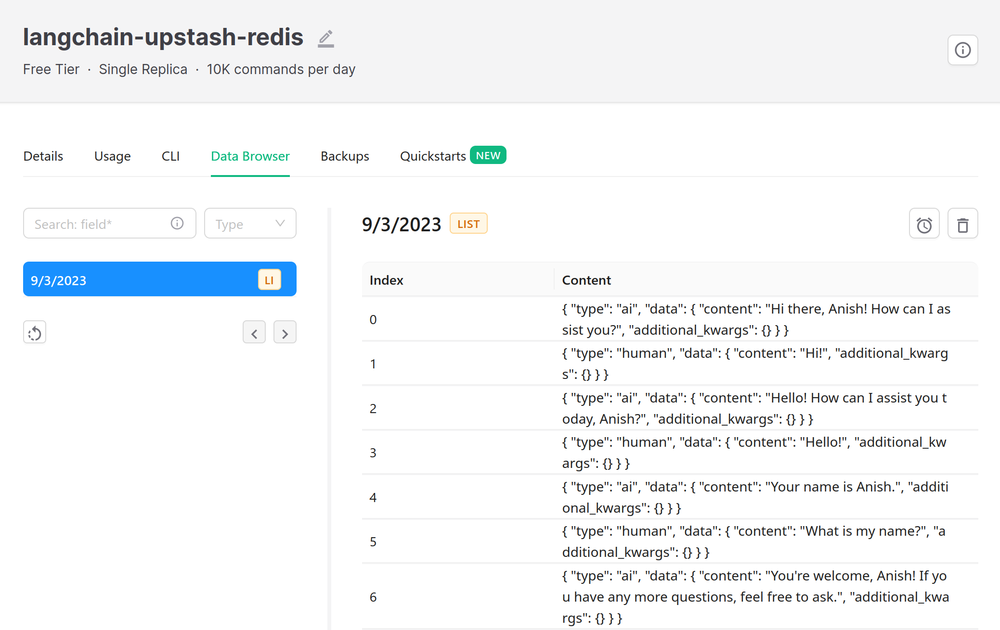

# Retaining Chat History using LangChain and Upstash Redis

LangChain provides a simple interface to conduct conversations between a human and an AI. It can be easily configured to use `BufferMemory`, enabling you to store conversation history in memory. This may be satisfactory for some use cases, but your apps may also require long-term persistence of chat history. Fortunately, it is just as straightforward to swap this out for an Upstash Redis instance.

LangChain provides multiple integrations for Redis, including `ioredis`, `node-redis` and Upstash Redis. Because the Upstash Redis client works via REST, you can use it to create edge-ready applications that can be deployed to Vercel, Cloudflare Workers, or any other serverless environment. We will be using it to create a simple chat app with memory that persists across sessions.

## Prerequisites

- [An Upstash Redis database](https://upstash.com/docs/redis/overall/getstarted)
- [An OpenAI API key](https://platform.openai.com/account/api-keys)

## Getting started

### Creating the project

We'll construct a basic Next.js app using the Vercel AI SDK to demonstrate how to use LangChain with Upstash Redis. To get started, create a new Next.js app:

```bash
npx create-next-app@latest
```

This will ask you to select a few project options. For most apps, the defaults will work fine. For the purpose of this demo, be sure to enable TypeScript and the `app` directory.

### Installing dependencies

Once the app is created, you'll need to install a few dependencies:

```bash
npm install ai langchain openai @upstash/redis
```

While not strictly required, the Vercel AI SDK will make it easier to stream responses from OpenAI to our Next.js frontend. We will only have to use `@upstash/redis` to create a Redis client—LangChain will take care of the rest.

### Setting environment variables

Finally, we'll need the following environment variables from the prerequisites earlier. Be sure to name them exactly as described here, because otherwise they won't be read them automatically! You can add these to a `.env` file in the root of your new project:

```bash
UPSTASH_REDIS_REST_URL="https://********.upstash.io"
UPSTASH_REDIS_REST_TOKEN="********"
OPENAI_API_KEY="sk-********"
```

## Creating a basic chat client

You'll notice that Next.js has created a number of files for us. We'll only be working with a few files in the `app` directory, so you can go ahead and delete everything currently in `public` and `app`.

To start off, we'll create a basic `app/layout.tsx` to house our app:

```tsx
import type { PropsWithChildren } from "react";

export default function RootLayout({ children }: PropsWithChildren) {
	return (
		<html lang="en">
			<body>{children}</body>
		</html>
	);
}
```

Next, we'll need a basic form with an input to accept messages from the user. This can be added to our `app/page.tsx`:

```tsx
export default function Home() {
	return (
		<main>
			<form>
				<input placeholder="Enter a message..." />
				<button type="submit">Send</button>
			</form>
		</main>
	);
}
```


The Vercel AI SDK exports a useful hook called `useChat`, which makes it very easy to create a conventional user interface for our chat app. It handles streaming chat messages and managing the state of our chat input. To use the hook, we need to tell React that this is a client component by adding the `"use client"` directive at the top of our file. Then, we can destructure a few properties from the `useChat` hook:

- `messages` is an array of messages that have been sent and received.
- `input` is the current value of the input field.
- `handleInputChange` is a function that updates the input value.
- `handleSubmit` is a function that sends the messages to our endpoint.

```tsx
"use client";

import { useChat } from "ai/react";

export default function Home() {
	const { messages, input, handleInputChange, handleSubmit } = useChat();

	return (
		<main>
			<form onSubmit={handleSubmit}>
				<input
					value={input}
					onChange={handleInputChange}
					placeholder="Enter a message..."
				/>
				<button type="submit">Send</button>
			</form>
		</main>
	);
}
```

Internally, the `useChat` hook automatically appends `input` to `messages` when `handleSubmit` is called, triggering a re-render so we don't have to worry about updating the UI ourselves. It will also clear the input field and trigger an API call to the specified endpoint. By default, this is `/api/chat`.

Finally, let's render the `messages` above our form:

```tsx
<main>
	<section>
		{messages.map((message) => (
			<p key={message.id}>{message.content}</p>
		))}
	</section>

	{/* snip */}
</main>
```

## Creating the API endpoint

We can start by creating an `app/api/chat/route.ts` file to house our endpoint. Next.js uses file-based routing for API endpoints as well as pages—this is why the folder structure for this new file matches the default endpoint, `/api/chat`, from before.

Because we're using Upstash Redis, our endpoint is edge-compatible. We can specify this by exporting `const runtime = "edge"` from our endpoint. In the endpoint itself, we can retrieve the `messages` field that the `useChat` hook populated for us. This allows us to pass the latest message to LangChain:

```ts
import { type NextRequest } from "next/server";
import { LangChainStream, StreamingTextResponse } from "ai";

export const runtime = "edge";

export async function POST(req: NextRequest) {
	const { messages } = await req.json();
	const { stream, handlers } = LangChainStream();

	const latestMessage = messages[messages.length - 1];

	return new StreamingTextResponse(stream);
}
```

Like `useChat` from before, `LangChainStream` also returns a few properties that we can destructure.

- `stream` is a `ReadableStream` that will eventually contain the results of the LangChain process.
- `handlers` is an object containing LLM callback functions that can be passed to LangChain.

Before we can implement the chain itself, we'll need to import a few additional classes:

```ts
import { Redis } from "@upstash/redis";

import { BufferMemory } from "langchain/memory";
import { UpstashRedisChatMessageHistory } from "langchain/stores/message/upstash_redis";
import { ChatOpenAI } from "langchain/chat_models/openai";
import { ConversationChain } from "langchain/chains";
```

We can now create a Redis client and set up the memory for our chain. Here, we create a `ConversationChain` that we can call in lieu of the model itself. It is a custom chain that facilitates holding conversations between a human and an AI. We can pass a custom `BaseMemory` implementation to the chain, which will be used to store and retrieve messages. In this case, we're using `BufferMemory` with `UpstashRedisChatMessageHistory` to store messages in Upstash Redis:

```ts
// snip
const latestMessage = messages[messages.length - 1];

const memory = new BufferMemory({
	chatHistory: new UpstashRedisChatMessageHistory({
		sessionId: new Date().toLocaleDateString(),
		client: Redis.fromEnv(),
	}),
});

const model = new ChatOpenAI({
	modelName: "gpt-3.5-turbo",
	streaming: true,
});

const chain = new ConversationChain({ llm: model, memory });
// snip
```

We construct a new Redis client using the `Redis` class explorted from `@upstash/redis`. It conveniently provides a method to load environment variables automatically, which mirrors the behavior of `ChatOpenAI`. As long as you named your environment variables correctly, you won't need to pass any additional arguments either of these classes.

In your app, you may want to use the user's ID or some other unique identifier for the `sessionId` to ensure that messages are not shared between users, but we'll use the current date for the sake of this demo. `UpstashRedisChatMessageHistory` provides more configuration options like `sessionTTL`, to set the lifetime of the cache.

It is important to enable `streaming` on the model, as this will allow us to use our destructured `handlers` object from before to pipe the results of the chain to `stream`.

Finally, we can call the chain, passing in the latest message and the `handlers` object:

```ts
// snip
const chain = new ConversationChain({ llm: model, memory });

chain.call({
	input: latestMessage.content,
	callbacks: [handlers],
});

return new StreamingTextResponse(stream);
// snip
```

Our `latestMessage` object from earlier is used as the prompt for the LLM. We also pass the `handlers` object to the chain, which will be used to pipe the results to `stream`.

## Conclusion

That's it! You can now run your app with `npm run dev` and start chatting with your AI. The response will automatically be streamed back to the client we created earlier, and the conversation history will be stored in Upstash Redis.




